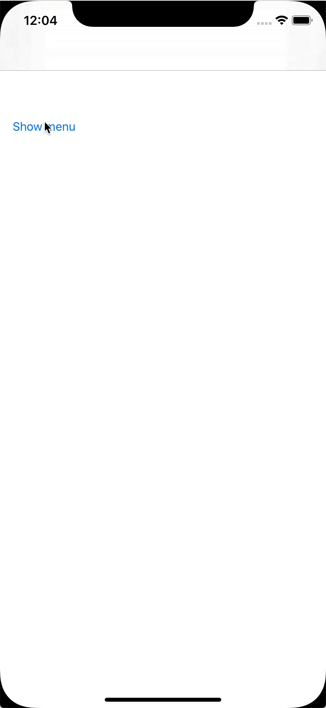
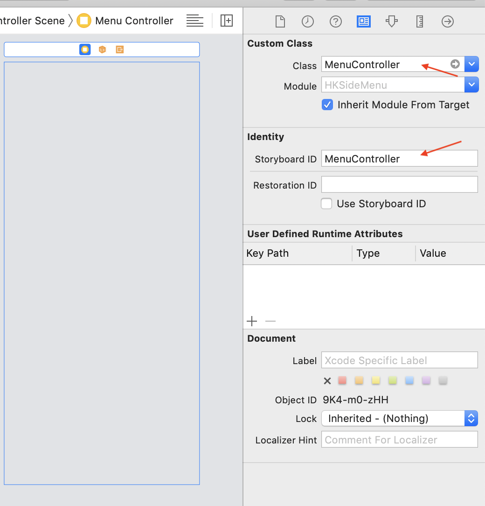

## SideMenu


Lightweight pod for inegration simple sideMenu to your iOS app.

<p align="left">
  
  
  </a>
  <a href="https://github.com/icon-project/ICONKit" target="_blank">
    
  </a>
    <a href="https://github.com/icon-project/ICONKit" target="_blank">
    
  </a>
</p>

<p align="center">
  
</p>


## Installation

### Using [CocoaPods](https://cocoapods.org):

Simply add the following line to your Podfile:

```ruby
pod 'HKSideMenu'
```

This will download the SideMenu binaries and dependencies in `Pods/` during your next
`pod install` execution.

This is the recommended way to install a specific version of SideMenu.


## Usage

* Create `Menu` for `SideMenu`. 

To do so, create `UIViewController` that conforms `MenuPresentable`. Override `storyboardName` - name for storyboard file in which Menu controller xib placed and `controllerIdentifier` - storyboard Id of controller.
Below example for MenuController that placed inside `Main.storyboard` and have identifier `MenuController`

``` swift
import UIKit

final class MenuController: UIViewController, MenuPresentable {

  static var storyboardName: String {
    return "Main"
  }

  static var controllerIdentifier: String {
    return String(describing: MenuController.self)
  }
}

```

Note: default implementation include next for `controllerIdentifier`:

``` swift
  static var controllerIdentifier: String {
    return String(describing: self)
  }
```

<p align="center">
  
</p>

* Create `RootController` for `SideMenu`.

This is controller, that will hold all content and side menu item.

For creating rootController you should create/use class `RootSideMenuController`. This class should be informed where he should look for `Menu`. To inform class about it - set sideMenu type to `RootSideMenuAppearence.menuType` before `RootSideMenuController` loaded:

`RootSideMenuAppearence.menuType = MenuController.self`

Full code:

``` swift
import UIKit

final class MyRootController: RootSideMenuController {
  // MARK: - LifeCycle

  override func viewDidLoad() {
  	 // make sure this done before `super.viewDidLoad`, in other case you will receive assertion
    RootSideMenuAppearence.menuType = MenuController.self

    super.viewDidLoad()
  }
}

```

✅ That's it - you done! Build and run the project.

To control menu state use `hideMenu` and `showMenu` actions from `RootSideMenuController`.


### Advanced configuration

User different options from `RootSideMenuAppearence` for controlling  appearence of menu

## TODO

- test
- option to move content instead of menu overlapping
- more appearence options
- simo menu (from left and right sides)

## Requirement

- Xcode 10 or higher
- iOS 11 or higher
- Swift 5 or higher
- [Cocoapods](https://cocoapods.org)

## License

[MIT licensed.](LICENSE)

## Contact

Have a question or an issue about `CalendarView`? Create an [issue](https://github.com/kirillgorbushko/CalendarView/issues/new)!

If you would like to contribute - just create a pull request.
